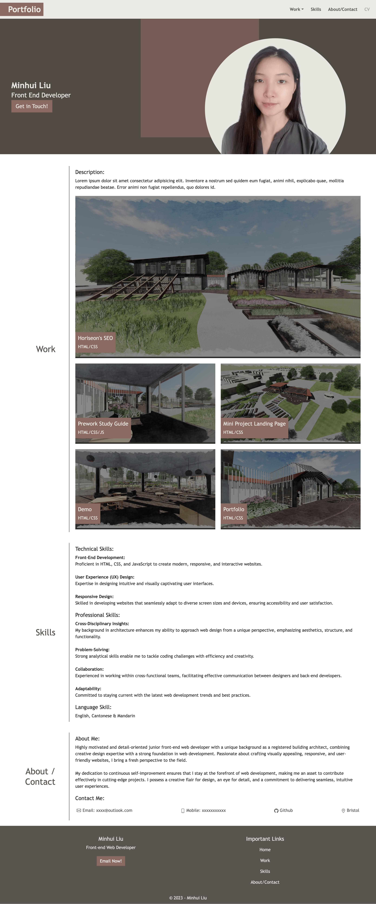
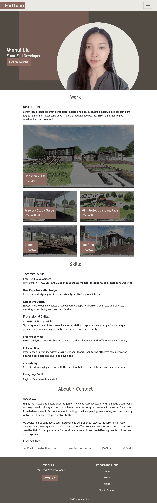
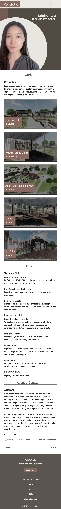

# bootstrap-portfolio
Portfolio Showcase: Web Page Crafted with Bootstrap.

## Description 

This bootstrap-portfolio project was created to exhibit my proficiency in website development, serving as a comprehensive showcase of my skills for prospective employers. It contains essential details including my name, photo, bio, portfolio, and contact information.

The HTML and CSS files were created from scratch, incorporating my newly acquired expertise in utilizing Bootstrap. Below, I've highlighted the integration of these skills within the project:
- Adding essential bootstrap css link, popper and JS codes into html 5 doctype file.
- Incorporating custom CSS stylesheet to modify Bootstrap components, loaded second after the essential Bootstrap stylesheet. This setup enables the project stylesheet to override Bootstrap classes, permitting the application of different styles to the same class in the customisation.
- Using and manipulating Bootstrap components including: Navigation bar, hero section created using jumbotron.
- Using bootstrap solution to minimise the use of media queries.

<!--
- Implementing a flex display to structure the various sections.
- Utilising a grid display to organize different projects within the 'Work' section and visually emphasize the primary project by presenting it prominently in a larger grid.
- As the page adjusts to different screen sizes and devices, its layout becomes responsive, seamlessly adapting to any viewport. 
- Upon clicking the work images, users are directed to the respective deployed application or github repository.
-->

The URL of the deployed application: 

The URL of the GitHub repository: https://github.com/ItIsMLiu/bootstrap-portfolio

The URL of my previously deployed portfolio: https://itismliu.github.io/portfolio-minhuiliu/

Screenshot of webpage when screen width is larger than 1000px:

Screenshot of webpage when screen width is between 600-1000px:

Screenshot of webpage when screen width is smaller than 1000px:

## Installation

N/A

## Usage 

<!--
To use the portfolio webpage, you can go through its various sections to explore infomation about me, my work, and my contact details. If you wish to review a specific section without having to scroll through the entire page, simply utilise the navigation bar located at the top right corner. From there, select one of the four options: 'About,' 'Work,' 'Contact' or 'CV' by clicking on your choice. This will promptly take you to the desired section on the webpage, where you can delve into the section contents.

This webpage is compatible with various screen sizes, as its layout will automatically respond and adapt. 

The graphics of the links in the navigation bar, the 'contact me' section, and images in the 'work' section will dynamically change as you hover the cursor over them.
-->

## Credits

Other resources used as guides:
- Bootstrap Documentation: https://getbootstrap.com/docs/5.3/getting-started/introduction/
- Responsive Web Design - How to Create Media Queries: https://www.youtube.com/watch?v=5xzaGSYd7jM
- Media Queries 101 by CSS Tricks: https://css-tricks.com/css-media-queries/
- Media Query Documentation: https://www.w3schools.com/css/css_rwd_mediaqueries.asp
- Github Pages Guide: https://pages.github.com/

## License

MIT license (Please refer to the LICENSE in the repository).